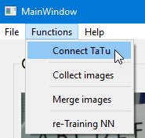
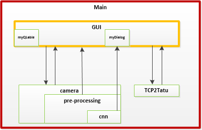

[TOC]

# Background
The brief introduction of this Project: digit recognition recognition with  USB-Camera .

This project uses `OpenCV`, `Pytorch` and `PyQt5`

The develop environment: `Pycharm CE` IDE with `Python 3.6`

# Install

Currently the project cannot be installed by `pip` or `conda` directly. 

but, you can automate install all the dependence by `pip` in the Python environment.

1. download the source code,then enter the root directory of the project

    `cd <work dir>`

2. use `pip3` to install related dependence automatically
   `pip3 install -r requirements.txt`

3. run `main.py` by `Python3`, then UI will pop up, enjoy the UI by yourself.

   `Python3 main.py`

# Introduction

The basic usage of this project is to recognize digit. additionally, we left some easy and flexible  options which can fit customized demands.

1. basic digit recognition mode
2. add new image to Database of CNN and re-training
3. connect to Schindler Internal tool: `TaTu` through TCP/IP, get the digit from `TaTu`

## Quick Start

### Basic digit recognition mode

use mouse choose an area in the window. then you can see the processed images and its outputs.

> notice: the `sample rate` means interval of prediction made by CNN.  the number is small, then this program will consume less resource of CPU.

### Add new image to Database of CNN and re-training

sometime, some digit may have a bad performance due to different format of font. you may need to collect the image of new digit then add it to the Database

1. enter the label of the digit
2. every click on button `Save Image` will store one image in system
3. click `Merge Image` will open a popup, delete images don't want, then click `open`. the images will move to the Database. 
4. click `Re-training NN`, in the popup, fill the hyper-parameter, then click `start`. after the progress bar reach 100%, close the popup.
5. reboot the UI
6. then you will see, the program can correctly recognize `-5`

### Connect TaTU

we can close the loop by connect TaTu which can control the digit in the indicator(COP/LOP).

we wont introduce how to set the TaTu, but how to connect TaTu by TCP/IP

## File architecture
purpose of directory

- asset: some temp file which is required by the project. **DO NOT delete it**
- input: dataset used by training CNN 
- output: some raw file generated during running. operate it at will
- `README.assets`: pic and gif used in the README.md
- UI: auto generated code by IDE, which is used as UI. **DO NOT delete it**

### File invocation order

for all the `.py` file, the entrance is `main.py`. it will create three threading, `_myGUI.py` ,`_myCamera.py` and `_myTCP_Client.py`

`main.py`

- `_myGUI.py`
    - `_myDialog .py`
    - `_myQlabel.py`
- `_myCamera.py`
    - `_myPreProcessing.py`
    - `_myCNN.py`
- `_myTCP_Client.py ` 

### Communication between threading

# Roadmap

1. Currently user cannot add more item to recognition, it is limited by CNN network. we could add one UI to guide user add or delete item
2. Add one option which can load image from local path. it will more convenient.
3. Update the CNN architecture in _myCNN, use transfer-learning based on `MNIST handwritten digit` will be a cool idea
4. currently architecture of CNN is based on Gray-image clipped by OpenCV, which means that when this clipping-image is wrong or contain other information. then, the CNN will output wrong result. So, use YOLO V3 maybe a good idea to recognize digit.

# Authors

`Andew Chu` in Schindler Elevator AP CO team.

Mail: `andrew.chu@schindler.com`

# License

This Project is licensed under the terms of the `GPL` Open Source license and is available for free.

Any conflict to the copyright of others, please contact author of this project to rectify it.

NOTICE: `PyQt5`is in Commercial and GPL license which means it has restriction with commercial-purpose usage. If there is any demand to use this project in commercial affair, you can simple use `Pyside2` to replace `PyQt5`

